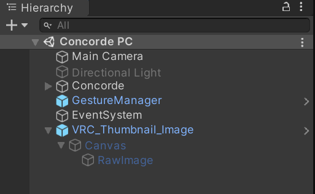
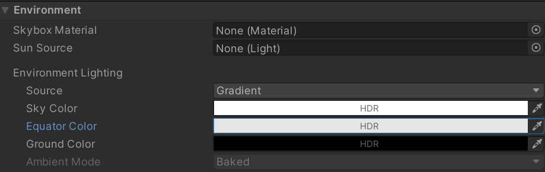

**This package is no longer required as the SDK now lets you specify an image during upload**

# VRC Thumbnail Image

A Unity script to automate using a static image as the background for your VRChat thumbnail.

## Usage

Ensure your Display 1 (in Game panel) is set to 4:3.

1. Import the `.unitypackage` into your project
2. Drag the `VRC_Thumbnail_Image.prefab` into your scene
3. Configure and test
4. Build your VRChat avatar or world and your image should be visible

## FAQ

### How do I scale/pose/animate my avatar for the thumbnail?

Create a new animator that plays your animation then enable "override animator".

Alternatively duplicate/prefab your avatar and hide the main one.

**If you want to animate your avatar's root transform you may need to disable "Apply Root Motion" in play mode.**

### How do I change the lighting?

Do this in Unity either through the Lighting panel or using lights in your scene.

I recommend disabling all scene lights and in the Lighting panel set the Environmental lighting source to a gradient from white then grey (224,224,224) then black:

