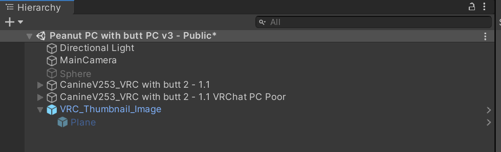

# VRC Thumbnail Image

A Unity script to set the VRC camera to a material when uploading your avatar.

## Usage

1. Import the Unity package into your project
2. Add `VRC_Thumbnail_Image.prefab` to your scene
3. Create a new material and insert it into "Material To Use" in the prefab's script
   - For albedo set it to a 4:3 image (eg. 1024x768)
   - Enable emission and set the emission to the same image
4. Build your avatar and your material should be visible

Enable "Is Testing" to preview the material in edit mode. Note the camera will not be identical to VRC's one.

## FAQ

### How do I change the lighting?

Play with the Unity lighting settings.

Enable emission in your material to override the lighting.

### How do I see my own avatar in the camera?

The script modified the VRC camera once. After it has modified it you can change it as much as you like.
